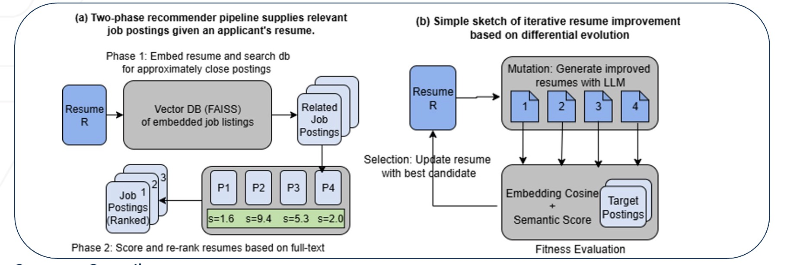
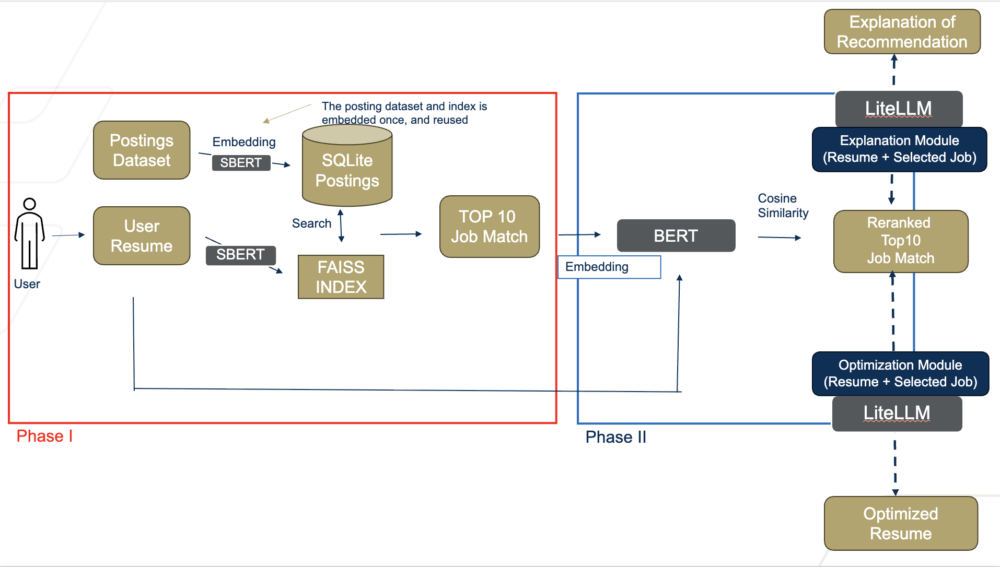
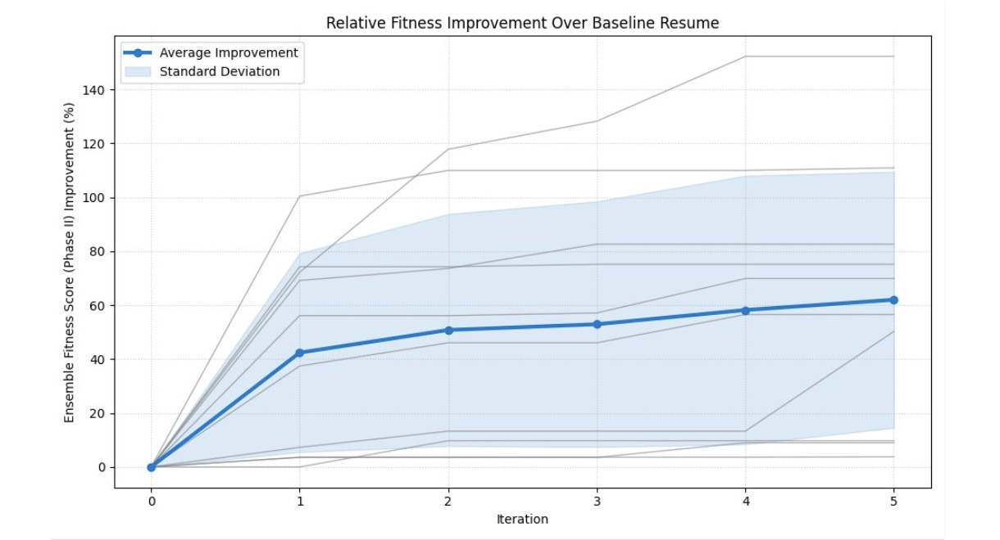

# Synapse: Evolving Job-Person Fit​

## What Our Project Does

**Synapse** is an intelligent, two-phase job–candidate matching and resume optimization system designed to bridge the gap between traditional keyword-based job search and the nuanced, contextual reasoning required for real-world hiring.  
Our system integrates:

- **SBERT-based embedding retrieval** for fast, scalable job matching  
- **Semantic reranking** for deeper contextual understanding  
- **RAG-driven explanations** for transparency and user trust  
- **Differential-evolution resume optimization** enabling LLM-guided iterative improvements  

## Motivation

Modern job platforms (e.g., LinkedIn, Indeed) primarily rely on **titles, keywords, or surface-level text similarity**, leading to mismatches such as:

- Candidates receiving irrelevant recommendations that ignore domain expertise  
- Employers struggling to identify applicants with specific skill requirements or cultural fit  
- Hard requirements hidden inside long job descriptions being overlooked  

As shown in our analysis of prior approaches

- **Keyword/embedding-only methods** miss nuances (e.g., seniority, domain specificity)
- **Collaborative filtering** requires proprietary labeled data and suffers from cold-start issues
- **LLM scoring** is expensive, inconsistent, and not natively comparative
- None alone provide **speed + accuracy + interpretability**


### Our Goal  
Build a system that is:

- **Fast** – suitable for real-time interactive search  
- **Effective** – matching candidates with highly relevant job postings  
- **Explainable** – providing transparent, traceable reasoning  

Synapse aims to make job search and resume tuning **data-driven, interpretable**.


## Synapse Architecture​



## Flow and Component Diagram


## Our Data Infrastructure

### Job Postings
We use a large-scale dataset of LinkedIn job postings:

- **Source:** LinkedIn job postings from **2023–2024**
- **Available on Kaggle:**  
  https://www.kaggle.com/datasets/arshkon/linkedin-job-postings/data
- **Size:** ~120,000 postings  
- **Fields include:**  
  - Company name  
  - Industry  
  - Job title  
  - Description  
  - Location  
  - Pay range  

---

### Resumes
Our system also uses a dataset of collected resumes:

- **Source:** Scraped from LiveCareer  
- **Available on Kaggle:**  
  https://www.kaggle.com/datasets/snehaanbhawal/resume-dataset/data
- **Size:** ~2,500 resumes  
- **Formats:** string + HTML  
- **Coverage:** multiple experience levels and job sectors  

---

### Relational Database (SQLite)
All postings and resumes are stored in a **SQLite relational database** for fast access.

- Total data volume: **~2 GB**  
- Designed for quick point queries (e.g., `job_id`)  
- Embeddings for postings are also stored inside this database for efficient retrieval  


## How do we embed data
### Recommender Phase I (embeddings/embed.py)
- We use SBERT (all-MiniLM-L6-v2). Outputs dense vectors.​
- Job fused text: title + company + skills_desc + description (+ level, location)​
- Resume text: full resume (headline + recent experiences + skills)​

### Recommender Phase II​ (embeddings/embed_stage2.py)

**Input:**  
- Postings retrieved from Phase I  
- User resume  

**Output:**  
- A re-ranked list of the Phase I job postings with improved semantic relevance  

## How to start/run our project
### 1. Clone the Repository

```bash
git clone <your-repo-url>
cd SYNAPSE-PERSON-JOB-FIT
```

### 2. Install Dependencies
```
pip install -r requirements.txt
```


### 3. Prepare Environment Variables
```
GEMINI_API_KEY=your_key_here
GEMINI_API_BASE_URL=your_proxy_url
```

### 4.load the postings
To get started, run 
```python infill_commands.py``` to load the postings into the sqllite database and setup faiss.

### 5. Evaluations
```
cd evaluations
```

```
python evaluation.py
```

```
python visualize_evolution.py
```



### 6. Run Resume Optimization
```
python resume_optimization.py
```

This will: Generate mutated resumes, Rank them using Phase 1/Phase 2, Produce the highest-fitness version
### 7. Launch the Streamlit Web UI
```
streamlit run streamlit_ui.py
```


## Beyond our Demo

###  `tune_bert.py`
Fine-tunes a **RoBERTa model** on our postings/resume dataset.

- Goal: Improve embedding quality by adapting RoBERTa to our domain  
- Outcome:  
  Finetuning had **minimal effect** on benchmark accuracy compared to using the pretrained HuggingFace model.  
  Because Phase I already retrieves highly relevant postings, gains in Phase II were limited.

###  `contrastive_learning.py`
Implements a full **contrastive learning (CL)** pipeline for job–resume semantic similarity.

Included components:
- Text preprocessing utilities  
- Dataset classes for resumes & postings  
- Model classes for CL training  
- Training loop & augmentation strategies  
- Multiple similarity scoring functions  

The similarity function currently used in the system is:  
**`soft_alignment_similarity`**  

### `embed_stage2.py`
Implements the second-stage embedding and similarity scoring logic.

Main feature:
- **`doc_sim_score(posting, resume)`**  
  Queries a trained CL model and computes a similarity score  
- Higher score = stronger semantic similarity  
- Used by Phase II and by ensemble scoring logic


## We Open Source Our Data and Index​

We open-source our full dataset — including **pre-embedded job postings**, **resume embeddings**, and a **ready-to-use FAISS index** — so users can run semantic search immediately without rebuilding embeddings.

**Starter notebook:**  
We provide a notebook demonstrating how to load the dataset, query the FAISS index, and run both Phase I and Phase II of the system.

**Download the dataset:**  
https://www.kaggle.com/datasets/anselerol/job-postings-and-resumes-with-embeddings-faiss/


## Directory Structure


## Future Work

### Additional Evaluation

- Larger dataset with empirical annotations for quantitative evaluation and model tuning  
- User studies and surveys to assess usability, trust, and perceived relevance  

### Model Optimization

- Current performance gains are small; requires larger and more diverse training samples  
- Evaluate the model using additional metrics (e.g., ensemble scores, human expert ratings), not only Phase-2 metrics  

### System Performance Optimization

- Utilize more advanced big-data tooling (e.g., **Apache Spark**) to parallelize embedding and preprocessing bottlenecks  
- Leverage **GPU acceleration** for embedding models and LLM-based components  
- Improve backend scalability to support many concurrent user requests  
- Reduce LLM latency by using faster APIs or self-hosting open-source models on high-performance GPUs  
